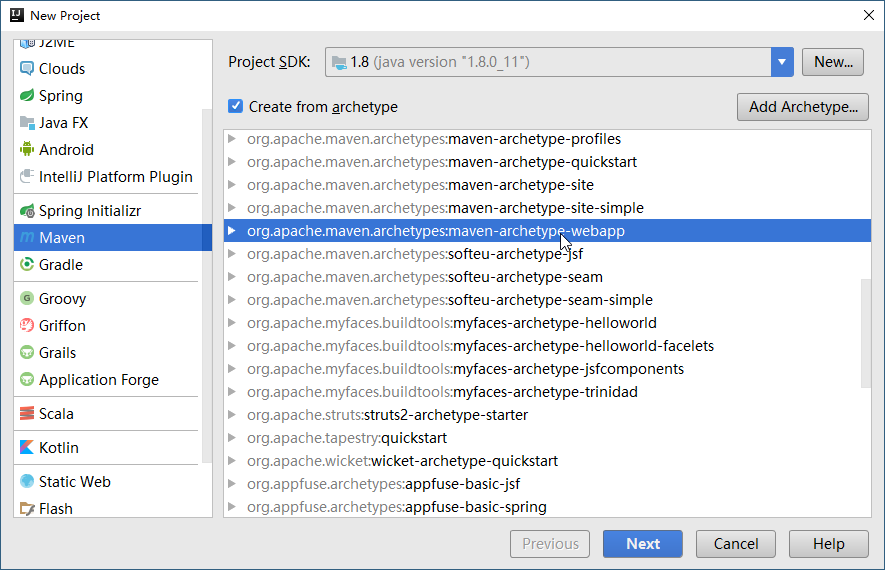

[Spring Document](https://docs.spring.io/spring/docs/4.3.21.RELEASE/spring-framework-reference/htmlsingle/#xsd-configuration)

# 1. 什么是Spring Framework

Spring Framework提供了建立企业级应用所需的一整套服务，并且Spring是模块化的，开发者可以自行搭配所需的模块。Spring是非侵入式的，应用的业务逻辑与Spring没有任何依赖关系。

# 2. Spring框架


# 3. Spring核心包

Spring的核心容器有：`spring-core`, `spring-beans`, `spring-context`, `spring-context-support`, `spring-expression`


# 4. 建立项目(idea) 

## 4.1 新建`maven-archetype-webapp`项目



## 4.2 项目目录

项目由如下四个目录：

- src/main/java
- src/main/resources
- src/test/java
- src/test/resources

在这四个目录中都可以使用`classpath:...`引用对应的内容。


## 4.3 添加

### 4.3.1 添加框架

添加spring和spring mvc框架

### 4.3.2 添加目录

添加src/main/java、src/main/test、src/main/resource

### 4.3.3 配置文件

`pom.xml`

```xml
<!--日志-->
    <dependency>
      <groupId>org.slf4j</groupId>
      <artifactId>slf4j-log4j12</artifactId>
      <version>1.7.21</version>
    </dependency>
    <!--J2EE-->
    <dependency>
      <groupId>javax.servlet</groupId>
      <artifactId>javax.servlet-api</artifactId>
      <version>3.1.0</version>
    </dependency>
    <dependency>
      <groupId>javax.servlet.jsp</groupId>
      <artifactId>jsp-api</artifactId>
      <version>2.2</version>
    </dependency>
    <dependency>
      <groupId>javax.servlet</groupId>
      <artifactId>jstl</artifactId>
      <version>1.2</version>
    </dependency>
    <!--mysql驱动包-->
    <dependency>
      <groupId>mysql</groupId>
      <artifactId>mysql-connector-java</artifactId>
      <version>5.1.35</version>
    </dependency>
    <!--springframework-->
    <dependency>
      <groupId>org.springframework</groupId>
      <artifactId>spring-web</artifactId>
      <version>4.2.6.RELEASE</version>
    </dependency>
    <dependency>
      <groupId>org.springframework</groupId>
      <artifactId>spring-webmvc</artifactId>
      <version>4.2.6.RELEASE</version>
    </dependency>
    <dependency>
      <groupId>org.springframework</groupId>
      <artifactId>spring-context</artifactId>
      <version>4.2.6.RELEASE</version>
    </dependency>
    <dependency>
      <groupId>org.springframework</groupId>
      <artifactId>spring-test</artifactId>
      <version>4.2.6.RELEASE</version>
    </dependency>
    <dependency>
      <groupId>org.springframework</groupId>
      <artifactId>spring-jdbc</artifactId>
      <version>4.2.6.RELEASE</version>
    </dependency>
    <!--其他需要的包-->
    <dependency>
      <groupId>org.apache.commons</groupId>
      <artifactId>commons-lang3</artifactId>
      <version>3.4</version>
    </dependency>
    <dependency>
      <groupId>commons-fileupload</groupId>
      <artifactId>commons-fileupload</artifactId>
      <version>1.3.1</version>
    </dependency>
```

`web.xml`

```xml
<!DOCTYPE web-app PUBLIC
 "-//Sun Microsystems, Inc.//DTD Web Application 2.3//EN"
 "http://java.sun.com/dtd/web-app_2_3.dtd" >

<web-app>
  <display-name>Archetype Created Web Application</display-name>
    <!--将contextConfigLocation加入配置文件中-->
    <context-param>
        <param-name>contextConfigLocation</param-name>
        <param-value>/WEB-INF/applicationContext.xml</param-value>
    </context-param>
    <listener>
        <listener-class>org.springframework.web.context.ContextLoaderListener</listener-class>
    </listener>

    <!--配置DispatcherServlet-->
    <servlet>
        <servlet-name>dispatcher</servlet-name>
        <servlet-class>org.springframework.web.servlet.DispatcherServlet</servlet-class>
        <init-param>
            <!--配置dispatcher.xml作为mvc的配置文件-->
            <param-name>contextConfigLocation</param-name>
            <param-value>/WEB-INF/dispatcher-servlet.xml</param-value>
        </init-param>
        <load-on-startup>1</load-on-startup>
    </servlet>
    <servlet-mapping>
        <servlet-name>dispatcher</servlet-name>
        <url-pattern>/</url-pattern>
    </servlet-mapping>


</web-app>
```


`applicationContext.xml`

```xml
<?xml version="1.0" encoding="UTF-8"?>
<beans xmlns="http://www.springframework.org/schema/beans"
       xmlns:xsi="http://www.w3.org/2001/XMLSchema-instance"
       xmlns:context="http://www.springframework.org/schema/context"
       xsi:schemaLocation="http://www.springframework.org/schema/beans http://www.springframework.org/schema/beans/spring-beans.xsd http://www.springframework.org/schema/context http://www.springframework.org/schema/context/spring-context.xsd">
</beans>
```


`dispatcher-servlet.xml`

```xml
<?xml version="1.0" encoding="UTF-8"?>
<beans xmlns="http://www.springframework.org/schema/beans"
       xmlns:xsi="http://www.w3.org/2001/XMLSchema-instance"
       xmlns:context="http://www.springframework.org/schema/context"
       xmlns:mvc="http://www.springframework.org/schema/mvc"
       xsi:schemaLocation="http://www.springframework.org/schema/beans http://www.springframework.org/schema/beans/spring-beans.xsd http://www.springframework.org/schema/context http://www.springframework.org/schema/context/spring-context.xsd http://www.springframework.org/schema/mvc http://www.springframework.org/schema/mvc/spring-mvc.xsd">
    <!--配置注解驱动-->
    <mvc:annotation-driven/>
    <!--启用Spring注解-->
    <context:annotation-config />
    <!-- 自动扫描装配 -->
    <context:component-scan base-package="com" />
    <!--静态资源映射-->
    <mvc:resources mapping="/css/**" location="/WEB-INF/statics/css/"/>
    <mvc:resources mapping="/js/**" location="/WEB-INF/statics/js/"/>
    <mvc:resources mapping="/image/**" location="/WEB-INF/statics/image/"/>
    <!--视图解析器配置-->
    <bean id="defaultViewResolver" class="org.springframework.web.servlet.view.InternalResourceViewResolver">
        <property name="viewClass" value="org.springframework.web.servlet.view.JstlView"/>
        <property name="prefix" value="/WEB-INF/views/"/><!--设置JSP文件的目录位置-->
        <property name="suffix" value=".jsp"/>
        <property name="exposeContextBeansAsAttributes" value="true"/>
    </bean>

</beans>
```

## 4.4 配置tomcat


## 4.5 运行Tomcat


# 5. spring aop

## 5.1 基本概念

切点：

切面：

通知：

引入：

织入：

# 5.2 demo

### 5.2.1 编写切点

```java
package com.pojo;

/**
 * Created by XiaoX on 2018/12/7.
 */
public interface Performance {
    public void perform();
}

```

### 5.2.2 定义切面

```java
package com.aspect;

import org.aspectj.lang.annotation.After;
import org.aspectj.lang.annotation.Aspect;
import org.aspectj.lang.annotation.Before;
import org.aspectj.lang.annotation.Pointcut;
import org.springframework.stereotype.Component;

/**
 * Created by XiaoX on 2018/12/7.
 */
@Component
@Aspect
public class Audience {
    @Pointcut("execution(* com.pojo.Performance.perform(..))")
    public void perform() {}

    @Before("perform()")
    public void silience() {
        System.out.println("开始了，手机静音。。。");
    }

    @After("perform()")
    public void leave() {
        System.out.println("结束了，离开会场。。。");
    }
}
```

### 5.2.3 配置

```xml
<?xml version="1.0" encoding="UTF-8"?>
<beans xmlns="http://www.springframework.org/schema/beans"
       xmlns:xsi="http://www.w3.org/2001/XMLSchema-instance"
       xmlns:context="http://www.springframework.org/schema/context"
       xmlns:aop="http://www.springframework.org/schema/aop"
       xsi:schemaLocation="http://www.springframework.org/schema/beans
       http://www.springframework.org/schema/beans/spring-beans.xsd
       http://www.springframework.org/schema/context
       http://www.springframework.org/schema/context/spring-context.xsd
       http://www.springframework.org/schema/aop
       http://www.springframework.org/schema/aop/spring-aop.xsd">
    <!--
        xmlns:aop="http://www.springframework.org/schema/aop"
        http://www.springframework.org/schema/aop
       http://www.springframework.org/schema/aop/spring-aop.xsd
       三条要同时加上，否则会报错
     -->
    <!--启用Spring注解-->
    <context:annotation-config />
    <!-- 自动扫描装配 -->
    <context:component-scan base-package="com" />
    <!-- 启用AspectJ自动代理 -->
    <aop:aspectj-autoproxy/>
</beans>
```


