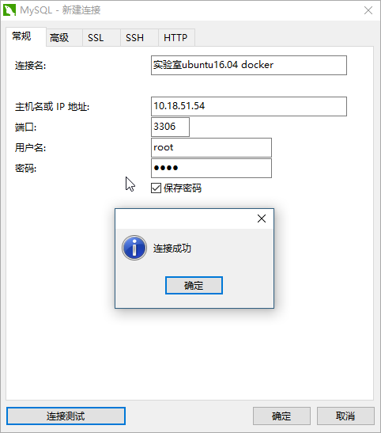

# 1. 什么是docker

> 镜像


> 容器

容器是一个镜像的实例。

> hub

镜像仓库。

# 2. docker基础

## 2.1 安装配置

### （1）centos7 下安装docker

```linux
# 在线安装docker
[xiaox@xiaox ~]$ sudo yum install docker
# 查看docker版本
[xiaox@xiaox ~]$ docker -v
Docker version 1.13.1, build 07f3374/1.13.1
# 切换到root用户(docker默认在root权限下运行)
[xiaox@xiaox ~]$ sudo su
# 启动docker
[root@xiaox xiaox]# systemctl start docker
# 查看docker状态
[root@xiaox xiaox]# systemctl status docker
● docker.service - Docker Application Container Engine
   Loaded: loaded (/usr/lib/systemd/system/docker.service; disabled; vendor preset: disabled)
   Active: active (running) since Sat 2018-12-08 14:02:52 CST; 4min 55s ago
     Docs: http://docs.docker.com
 Main PID: 25854 (dockerd-current)
...
# 关闭docker
[root@xiaox docker]# systemctl stop docker
```

### （2）为docker切换源

```linux
# docker位置
[root@xiaox docker]# pwd
/etc/docker
# docker目录下配置文件
[root@xiaox docker]# ll
total 24
drwxr-xr-x 5 root root  4096 Dec  8 14:00 certs.d
-rw-r--r-- 1 root root     3 Nov 29 22:41 daemon.json
-rw------- 1 root root   244 Dec  8 14:02 key.json
-rw-r--r-- 1 root root 10837 Nov 29 22:41 seccomp.json
[root@xiaox docker]# vim daemon.json
[root@xiaox docker]# cat daemon.json 
{
	"registry-mirrors": ["https://wetaung7.mirror.aliyuncs.com"]
}
# 重启docker

```

## 2.2 基本的docker命令&操作

### 2.2.1 镜像操作

| 操作 | 命令                                            | 说明                                    |
| ---- | ----------------------------------------------- | --------------------------------------- |
| 检索 | `docker search` 【镜像名称，例如mysql】         | 在docker hub上查询镜像，类似于maven仓库 |
| 拉取 | `dcoker pull`【镜像名称:TAG，例如mysql:lastet】 | TAG是可选的，默认是`lastest`            |
| 列表 | `docker images`                                 | 查看本地镜像列表                        |
| 删除 | `docker rmi image-id`                           | 删除本地镜像                            |

```linux
# 查询redis
[root@xiaox docker]# docker search redis
INDEX       NAME                                        DESCRIPTION                                     STARS     OFFICIAL   AUTOMATED
docker.io   docker.io/redis                             Redis is an open source key-value store th...   6235      [OK]       
docker.io   docker.io/bitnami/redis                     Bitnami Redis Docker Image                      99                   [OK]
docker.io   docker.io/sameersbn/redis                                                                   75                   [OK]
docker.io   docker.io/grokzen/redis-cluster             Redis cluster 3.0, 3.2, 4.0 & 5.0               39                   
docker.io   docker.io/hypriot/rpi-redis                 Raspberry Pi compatible redis image             34                   
docker.io   docker.io/kubeguide/redis-master            redis-master with "Hello World!"                27                   
docker.io   docker.io/kubeguide/guestbook-redis-slave   Guestbook redis slave                           22                   
docker.io   docker.io/rediscommander/redis-commander    Alpine image for redis-commander - Redis m...   18                   [OK]
。。。

# 下载redis
[root@xiaox docker]# docker pull redis
Using default tag: latest
Trying to pull repository docker.io/library/redis ... 
latest: Pulling from docker.io/library/redis
a5a6f2f73cd8: Pull complete 
a6d0f7688756: Pull complete 
53e16f6135a5: Pull complete 
b761e99e9c9c: Pull complete 
13686b3f2e29: Pull complete 
667e8fd02be2: Pull complete 
Digest: sha256:f57d1597d038a742dfba6acfaf48b10e6383466eea2aef95d1ee76f32633f959
Status: Downloaded newer image for docker.io/redis:latest

# 查看本地镜像
[root@xiaox docker]# docker images
REPOSITORY          TAG                 IMAGE ID            CREATED             SIZE
docker.io/redis     latest              5958914cc558        9 days ago          94.9 MB

# 删除本地镜像
[root@xiaox docker]# docker rmi redis
Untagged: redis:latest
Untagged: docker.io/redis@sha256:f57d1597d038a742dfba6acfaf48b10e6383466eea2aef95d1ee76f32633f959
Deleted: sha256:5958914cc55880091b005658a79645a90fd44ac6a33abef25d6be87658eb9599
Deleted: sha256:2034be36bd0f105ea0b4cbb124a96fa434fda3ce9c32dddcf38f1b6e5699ac91
Deleted: sha256:c2d3730f64b8e231f59d86ac8bdf6de3e62538a5b0030c9a37bf1cf21241ec76
Deleted: sha256:1a869407b0486b83e44fcec89fc7b12935c23caea8768e0e9402df67a01f4ffe
Deleted: sha256:1568b09301049abf7ed4b38406ce96465f2145af91428d9efa8c8c0dc53297fa
Deleted: sha256:42bd21f043c373312ccf3f31fcfeabf596497421e9ff0103b6fb7dc764de631e
Deleted: sha256:ef68f6734aa485edf13a8509fe60e4272428deaf63f446a441b79d47fc5d17d3
[root@xiaox docker]# docker images
REPOSITORY          TAG                 IMAGE ID            CREATED             SIZE
[root@xiaox docker]# 
```

### 2.2.2 容器操作

| 操作     | 命令                  | 说明                                         |
| -------- | --------------------- | -------------------------------------------- |
| 查看容器 | `docker ps 容器id`    | 默认显示运行中的容器，-a查看所有的所有的容器 |
| 删除容器 | `docker rm 容器id`    | 删除指定的容器                               |
| 启动容器 | `docker run 容器名称` |                                              |
| 关闭容器 | `docker stop 容器id`  |                                              |

```linux
root@xiaox:/etc/docker# docker ps -a
CONTAINER ID        IMAGE               COMMAND                CREATED             STATUS                      PORTS               NAMES
6a4261000b09        mysql:latest        "docker-entrypoint.s   10 minutes ago      Exited (0) 3 minutes ago                        mysql01             
617ae7aa6c75        mysql:latest        "docker-entrypoint.s   13 minutes ago      Exited (0) 11 minutes ago                       MYSQL               
root@xiaox:/etc/docker# docker rm 6a4261000b09
6a4261000b09
root@xiaox:/etc/docker# docker ps -a
CONTAINER ID        IMAGE               COMMAND                CREATED             STATUS                      PORTS               NAMES
617ae7aa6c75        mysql:latest        "docker-entrypoint.s   14 minutes ago      Exited (0) 11 minutes ago                       MYSQL 
```


```linux
# 启动mysql5.6
# -p 指定端口，-d 以daemon模式运行，后台守护进程，--name 指定容器名称
root@xiaox:/etc/docker# docker run -p 3306:3306 --name mysql01 -e MYSQL_ROOT_PASSWORD=root -d mysql:5.6
f995e09a49c84ec6f36ed78edff26b0fa136a7ac9326412484db9b5479df4175
root@xiaox:/etc/docker# docker ps
CONTAINER ID        IMAGE               COMMAND                CREATED             STATUS              PORTS                    NAMES
f995e09a49c8        mysql:5.6           "docker-entrypoint.s   3 seconds ago       Up 2 seconds        0.0.0.0:3306->3306/tcp   mysql01
```



# 3. docker compose

>docker自动化工具

## 3.1 下载

```linux
curl -L https://github.com/docker/compose/releases/download/1.9.0/docker-compose-$(uname -s)-$(uname -m) > /usr/local/bin/docker-compose
```

## 3.2 基本命令&操作

### 3.2.1 镜像

### 3.2.2. 容器

