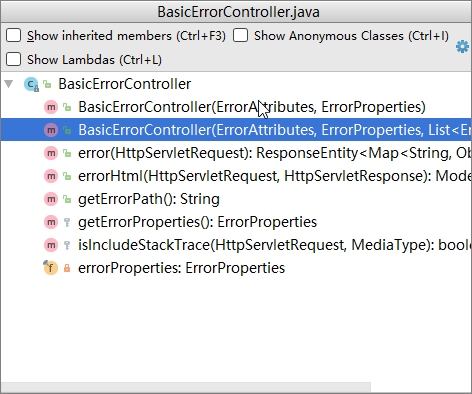
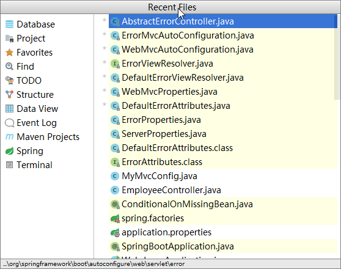
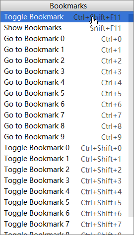

> idea的一些基础知识

## 基础命令

#### 查找

#### 快速打开窗口

侧边栏 ：alt+number(数字键)`

回到代码编辑器：`esc`

#### 编程中的常用快捷键

文件结构：`ctrl+F3`

最近文件：`ctrl+E`

快速查找：`shift+shift`

#### 快速跳转

（1）编辑位置跳转：`ctrl+Q`
（2）浏览位置跳转：``

（3）利用书签位置跳转：

